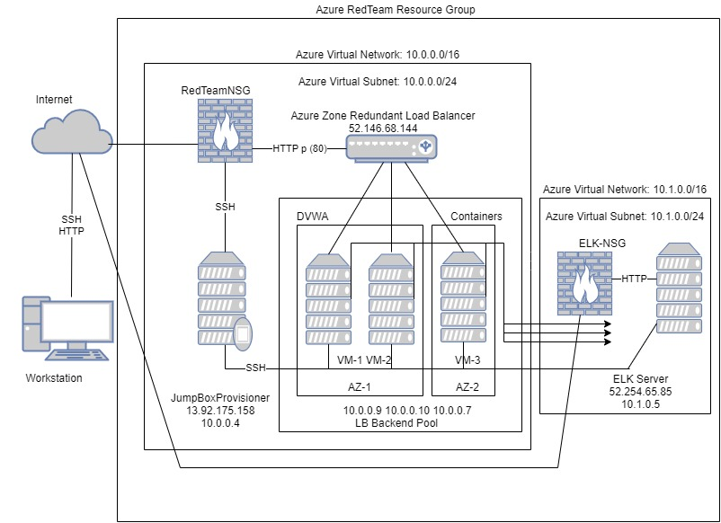
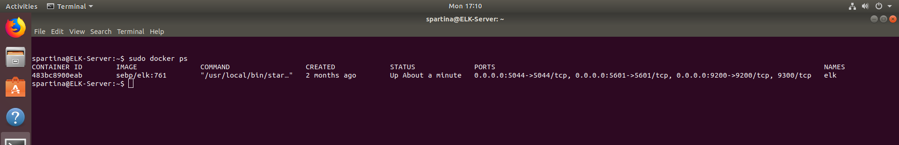
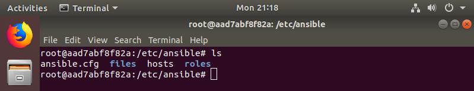

## cloud-based Docker/Ansible ELK Stack Deployment
 

The files in this repository were used to configure the network depicted below.

`Azure-vNet.jpg` 



These files have been tested and used to generate a live ELK deployment on Azure. They can be used to either recreate the entire deployment pictured above. Alternatively, select portions of the YAML file may be used to install only certain pieces of it, such as Filebeat.

  - _[link to YAML files!](ansible)_

This document contains the following details:
- Description of the Topology
- Access Policies
- ELK Configuration
  - Beats in Use
  - Machines Being Monitored
- How to Use the Ansible Build


### Description of the Topology

The main purpose of this network is to expose a load-balanced and monitored instance of DVWA, the D*mn Vulnerable Web Application.

Load balancing ensures that the application will be highly available, in addition to restricting access to the network.

Integrating an ELK server allows users to easily monitor the vulnerable VMs for changes to the log files and system metrics.

The configuration details of each machine may be found below.

| Name     | Function | IP Address | Operating System |
|----------|----------|------------|------------------|
| Jump Box | Gateway  | 10.0.0.4   | Linux            |
| DVWA-VM1 | DVWA     | 10.0.0.9   | Linux            |
| DVWA-VM2 | DVWA     | 10.0.0.10  | Linux            |
| DVWA-VM3 | DVWA     | 10.0.0.7   | Linux            |
| ELK Server | ELK stack | 10.1.0.5  | Linux            | 

### Access Policies

The machines on the internal network are not exposed to the public Internet. 

Only the Jump Box machine can accept connections from the Internet. Access to this machine is only allowed from the following IP addresse:
- _Home-Office ipv4_

Machines within the network can only be accessed by a shell on an ansible container within the Jump Box.

A summary of the access policies in place can be found in the table below.

| Name     | Publicly Accessible | Allowed IP Addresses |
|----------|---------------------|----------------------|
| Jump Box | Yes                 | home office ip    |  
| ELK server| No                |10.0.0.4 10.0.0.7 10.0.0.9 10.0.0.10 |
| DVWA-VM1 |  No                 | 10.0.0.4  10.1.0.5                   |
| DVWA-VM2 |  No                 | 10.0.0.4  10.1.0.5                   |
|DVWA-VM3  |  No                 | 10.0.0.4  10.1.0.5                   |  
### Elk Configuration

Ansible was used to automate configuration of the ELK machine. No configuration was performed manually, which is advantageous because...
- Consistency: ansible allows for uniformity on provisioned scripts, leading to susscesfull installation of curated YAML files.  
- Scalability: ansible provides an enviroment on which one server or multiple servers can be provisioned at once.
- Redundancy: ansible helps prevent web-application's down-time by allowing the replacement of one or more compromised servers without interrupting service.  

The playbook implements the following tasks:
- The playbook instructs to look for the [elkservers] group and targeted ip addresses and install an instance of docker.io.
- following, the YAML file installs python3-pip.
- next installation of a docker python module: docker.
- expansion of memory by 262144 using vm.max_map_count.
- finally, downloads and install the image of the ELK container: sebp/elk:761 and published ports.

The following screenshot displays the result of running `docker ps` after successfully configuring the ELK instance.



### Target Machines & Beats
This ELK server is configured to monitor the following machines:
- 10.0.0.7
- 10.0.0.9
- 10.0.0.10

We have installed the following Beats on these machines:
- Filebeat
- Metricbeat

These Beats allow us to collect the following information from each machine:
- Filebeat allows harversting changes in log files, one of the files that Filebeat monitors is `syslog input`  
were it reads events over TCP,UDP,or a Unix stream socket.  Metricbeat measures system metrics including : cpu-usage, memory and task-manager like statistics.
On both cases, the logs collected are sent to logstash for were they are filtered and by priorities, from lostash the logs are sent to elasticsearch for indexing and lastly to kibana for visualisation. 

### Using the Playbook
In order to use the playbook, you will need to have an Ansible control node already configured. Assuming you have such a control node provisioned: 

SSH into the control node and follow the steps below:


- Copy the `elk-playbook.yml` file to the `roles` directory in the ansible control node.
- Update the `hosts` file to include the `[group-name]` that includes the internal ip adresses of the targeted virtual machines.
- Run the playbook, and navigate to http://[your.VM.IP]:5601/app/kibana to check that the installation worked as expected.

To download the elk-playbook run :
```
curl https://raw.githubusercontent.com/Gosejol/cyberclass/main/ansible/ELK/elk-playbook.yml?token=AQORTIXPSWR5GEUULMYLXUS77USYA 
> /etc/ansible/roles/elk-playbook.yml
```

To update the ansible configuration file add the server user name to the remote_user and uncoment:

```
# default user to use for playbooks if user is not specified
# (/usr/bin/ansible will use current user as default)
remote_user = spartina
```

To update the ansible hosts file add the name of the group [elkserver] and the ip adresses of the targeted machines.
```
[spartina]
10.0.0.7 ansible_python_interpreter=/usr/bin/python3
10.0.0.9 ansible_python_interpreter=/usr/bin/python3
10.0.0.10 ansible_python_interpreter=/usr/bin/python3

#List the IP address of your ELK server
#There should only be one IP address
[elkservers]
10.1.0.5 ansible_python_interpreter=/usr/bin/python3
```
To deploy the elk-playbook.yml:

```
RUN:  sudo ansible-playbook elk-playbook.yml  while on the roles directory.
```
